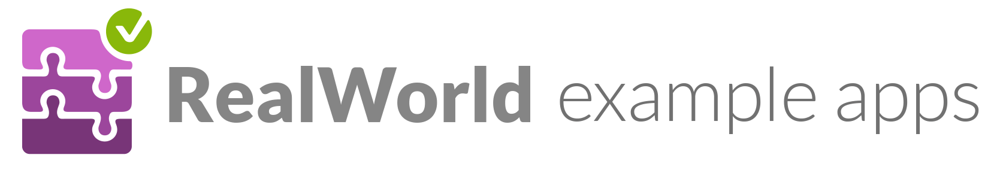

### See how [_the exact same_ Medium.com clone](https://demo.realworld.show) is built using different [frontends](https://codebase.show/projects/realworld?category=frontend) and [backends](https://codebase.show/projects/realworld?category=backend)

You can combine any frontend with any backend, because **they all adhere to the same API spec**

While most "todo" demos provide an excellent cursory glance at a framework's capabilities, they typically don't convey the knowledge & perspective required to actually build _real_ applications with it.

**RealWorld** solves this by allowing you to choose any frontend (React, Angular, & more) and any backend (Node, Django, & more).

_Read the [full blog post announcing RealWorld on Medium.](https://medium.com/@ericsimons/introducing-realworld-6016654d36b5)_

Join us on [GitHub Discussions!](https://github.com/realworld-apps/realworld/discussions) 🎉

# Implementations

Over 100 implementations have been created using various languages, libraries, and frameworks.

Explore them on [**CodebaseShow**](https://codebase.show/projects/realworld).

# Create a new implementation

[**Create a new implementation >>>**](https://docs.realworld.show/implementation-creation/introduction)

Or you can [view upcoming implementations (WIPs)](https://github.com/realworld-apps/realworld/discussions/categories/wip-implementations).

# Learn more

- [Documentation introduction](https://docs.realworld.show/introduction/)
- Every tutorial is built against the same [API spec](api/) to ensure modularity of every frontend & backend
- Every frontend utilizes the same handcrafted [Bootstrap 4 theme](https://github.com/gothinkster/conduit-bootstrap-template) for identical UI/UX
- There is a hosted version of the backend API available for public usage at [api.realworld.show](https://api.realworld.show) (with strong account isolation), no API keys are required
- There is an angular frontend plugged to this backend available at [demo.realworld.show](https://demo.realworld.show)
- Interested in creating a new RealWorld stack? View our [starter guide & spec](https://docs.realworld.show/implementation-creation/introduction)

# Active Maintainers

- **[c4ffein](https://github.com/c4ffein) - Maintainer** - currently maintains the [demo website](https://demo.realworld.show)
- **[Manuel Vila](https://github.com/mvila) - Maintainer** - creator of the [Layr framework](https://layrjs.com) and the [CodebaseShow website](https://codebase.show/)
