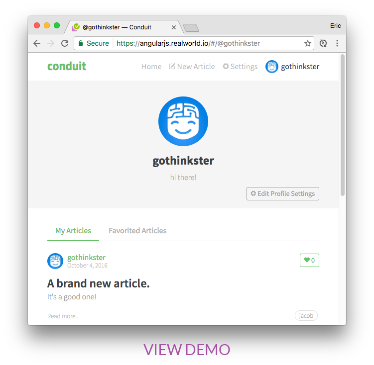

# 

> Choose your next stack! Exemplary fullstack blog apps powered by React, Angular, Node, Django, and many more 🏅

  

### See how *the exact same* real world blogging platform ([Conduit](https://demo.realworld.io)) is built using any of our supported [frontends](#frontends) and  [backends](#backends). Yes, you can mix and match them, because **they all adhere to the same [API spec](spec/)** 😮😎

While most demos/tutorials provide an excellent cursory glance at a framework's capabilities, they typically don't convey the knowledge & perspective required to actually build "real" applications with it.

RealWorld solves this by allowing you to choose any frontend (React, Angular 2, & more) and any backend (Node, Django, & more) and see how they power a real world, beautifully designed fullstack app called "[Conduit](https://demo.realworld.io)".

*Read the [full blog post announcing RealWorld on Medium.](https://medium.com/@ericsimons/introducing-realworld-6016654d36b5)* 

# Frontends

| [Angular 2+](https://github.com/gothinkster/angular2-realworld-example-app) | [React / Redux](https://github.com/gothinkster/react-redux-realworld-example-app) | [Angular 1.5+](https://github.com/gothinkster/angularjs-realworld-example-app) |
| :---:         |     :---:      |          :---: |
|  |  |  |

Work In Progress: **[Ember](https://github.com/gothinkster/realworld/issues/22) | [Vue](https://github.com/gothinkster/realworld/issues/7) | [React+MobX](https://github.com/gothinkster/realworld/issues/33) | [React+Relay](https://github.com/gothinkster/realworld/issues/48) | [Svelte](https://github.com/gothinkster/realworld/issues/19) | [Elm](https://github.com/gothinkster/realworld/issues/13) | [Aurelia](https://github.com/gothinkster/realworld/issues/27) | [ClojureScript](https://github.com/gothinkster/realworld/issues/61)**

# Backends

| [Node / Express](https://github.com/gothinkster/node-express-realworld-example-app) | [Django](https://github.com/gothinkster/django-realworld-example-app) | [Rails](https://github.com/gothinkster/rails-realworld-example-app) |
| :---:         |     :---:      |          :---: |
|  |  |  |

Work In Progress: **[Flask](https://github.com/gothinkster/realworld/issues/51) | [Go](https://github.com/gothinkster/realworld/issues/45) | [Elixir + Phoenix](https://github.com/gothinkster/realworld/issues/17) | [GraphQL / Apollo](https://github.com/gothinkster/realworld/issues/46) | [Node.js Lambda + DynamoDB](https://github.com/gothinkster/realworld/issues/37) | [Go + Gin](https://github.com/gothinkster/realworld/issues/9) | [Rust](https://github.com/gothinkster/realworld/issues/24) | [Firebase + GCP Cloud Functions](https://github.com/gothinkster/realworld/issues/21) | [Laravel](https://github.com/gothinkster/realworld/issues/20) | [.NET Core](https://github.com/gothinkster/realworld/issues/31) | [HapiJS](https://github.com/gothinkster/realworld/issues/40) | [Falcon + GAE](https://github.com/gothinkster/realworld/issues/59) | [Nim](https://github.com/gothinkster/realworld/issues/60) | [Scala + Play](https://github.com/gothinkster/realworld/issues/63) | [Koa.js(Node.js) + knex(SQL)](https://github.com/gothinkster/realworld/issues/49) | [Slim](https://github.com/gothinkster/realworld/issues/50) | [Clojure](https://github.com/gothinkster/realworld/issues/57) | [Spring (w/ Spring Boot)](https://github.com/gothinkster/realworld/issues/55) | [F#](https://github.com/gothinkster/realworld/issues/58), [Symphony](https://github.com/gothinkster/realworld/issues/66)**

# Mobile

Work In Progress: **[React Native](https://github.com/gothinkster/realworld/issues/10) | [Ionic 2+](https://github.com/gothinkster/realworld/issues/16)**

# Create a new stack

### Know any of these frameworks (or one that isn't listed)? [**Create a new framework implementation >>>**](/spec)

Or you can [view upcoming stacks (WIPs)](https://github.com/gothinkster/realworld/issues?q=is%3Aopen+is%3Aissue+label%3Awip)

Note: All stacks that are a WIP are experimental and incomplete.

Don't expect everything to work perfectly out of the box!

 

# How do I get up & running?

Simply follow the instructions in the README of whatever frontend and/or backend repo's you want to get up and running.

### Can you teach me how to build each stack from scratch?

Yup! We've built step-by-step tutorials for all of our stacks that teach you how to go from `git init` all the way to the production ready application. [**Start learning now >>>**](https://thinkster.io/tutorials/fullstack)

 

# Community created resources

Forks, tutorials, workshops, and other resources based on the RealWorld project:

- [**React+Redux / Node testing workshop**](https://github.com/kentcdodds/testing-workshop) by [**Kent C. Dodds**](https://github.com/kentcdodds)
  - Example repo showing the React+Redux and Node stacks working together w/ TDD
  - Live recording of his workshop is [**available on YouTube**](https://www.youtube.com/watch?v=DdqiXcYDv-8)

 

# Learn more

- ["Introducing RealWorld 🙌"](https://medium.com/@ericsimons/introducing-realworld-6016654d36b5) by Eric Simons
- Every tutorial is built against the same [API spec](api/) to ensure modularity of every frontend & backend 
- Every frontend utilizes the same hand crafted [Bootstrap 4 theme](https://github.com/gothinkster/conduit-bootstrap-template) for identical UI/UX
- There is a hosted version of the backend API available for public usage, no API keys required
- Interested in creating a new RealWorld stack? View our [starter guide & spec](/spec)

 

# Who made this?

RealWorld would not be possible without the [open source community](#special-thanks-to) continuously helping push the project forward. In addition, we have a core project team composed of:

#### [Eric Simons](https://twitter.com/ericsimons40) - Founder/Lead

Eric is a Software Engineer, UI Designer, and author of many technical books & tutorials. He oversees the project direction, maintenance and organizes the planning and development efforts of the team.

#### [Albert Pai](https://twitter.com/iamalbertpai) - Founder/Lead

Albert is a Software Engineer, DevOps ninja, and author of many technical books & tutorials. He oversees the project direction, maintenance and organizes the planning and development efforts of the team.

#### [Thinkster](https://twitter.com/gothinkster) - Funding/Support

[Thinkster](https://thinkster.io) creates high quality resources that help Javascript developers succeed. The RealWorld project wouldn't exist without their funding, so please consider investing in [a Pro subscription](https://thinkster.io/pro) to help support us!

#### [James Brewer](https://twitter.com/brwr_) - Advisor, Creator of RealWorld Django

James is a Software Engineer at Square and a contributor to the Django project. He created & maintains the RW Django codebase and continually provides guidance for the RealWorld project itself.

#### [Val Karpov](https://twitter.com/code_barbarian) - Creator of RealWorld React & Redux

Val Karpov is a Software Engineer at Booster Fuels and is a core contributor to Mongoose. He created & maintains the RealWorld React/Redux codebase.

## Special thanks to...

RealWorld wouldn't be possible without the help of the open source community reviewing codebases, creating new app implementations, and many other tasks that help push this project forward. We especially appreciate the OSS leaders who have helped contribute to RealWorld:

- **Dan Abramov** (creator of Redux) for  helping [spark the initial idea](https://twitter.com/dan_abramov/status/692009757775896577), [getting the Redux community involved](https://github.com/reactjs/redux/issues/1353), as well as graciously taking the time to provide feedback on the Redux codebase
- **Max Lynch** (creator of Ionic) for taking the time to provide guidance in the early days of this project
- **Addy Osmani** (creator of TodoMVC) for helping [spark the initial idea](https://twitter.com/addyosmani/status/762828483433144320) and his amazing work with TodoMVC
- **TodoMVC** ([team & contributors](https://github.com/tastejs/todomvc#team)) for their exemplary & successful work; their project & org has been an invaluable analogy for us as we've built out RealWorld
- **James Brewer** (docs contributor to Django) for countless brainstorming sessions, helping name this project, and creating the Django codebase + tutorial

# License
All of the codebases are **MIT licensed** unless otherwise specified.

 

